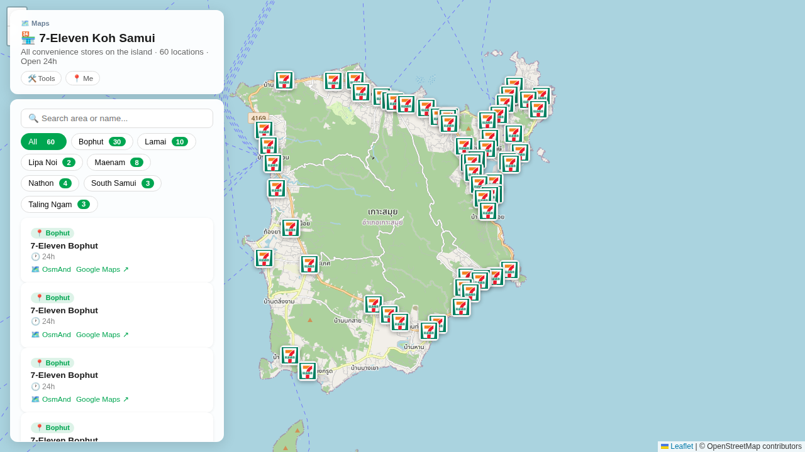

# 🏪 711 Samui Map — Android App

An interactive Android app displaying all 7-Eleven convenience store locations on Koh Samui, Thailand. Find stores by area, get directions, and access navigation with OsmAnd or Google Maps.

**Live on:** [hands.build](https://hands.build) • **Open source:** MIT License

---

## ✨ Features

- 🗺️ **Interactive Map** — Leaflet-powered map with 98 7-Eleven locations across 7 areas
- 📍 **Area Filters** — Browse stores by Bophut, Lamai, Maenam, Nathon, and more
- 🔍 **Search** — Find stores by name or area
- 🧭 **Navigation** — Launch OsmAnd or Google Maps directly from the app
- 📱 **Offline Ready** — Works offline; map tiles cached after first load
- 🔋 **Lightweight** — ~14 MB APK, minimal resource usage

---

## 📸 Screenshots



Interactive map showing all 7-Eleven locations with filters by area and search functionality.

---

## 🚀 Installation

### Option 1: hands.build (Recommended)
Download from the [hands.build app](https://hands.build) (main channel):
- Auto-updates enabled
- Preview channel available for beta testing

### Option 2: F-Droid
Coming soon! App will be available on F-Droid for open-source Android apps.

### Option 3: Direct APK
Download the latest release from [GitHub Releases](https://github.com/alx/711-samui-map/releases):
1. Enable "Install from unknown sources" in device settings (if needed)
2. Download and tap the `.apk` file
3. Follow the installation prompts

---

## 🛠️ Build from Source

### Prerequisites
- **Android SDK** (API 34+) — [Install](https://developer.android.com/studio/install)
- **Java 21+**
- **Node.js 18+**

### Quick Start
```bash
# Clone the repository
git clone https://github.com/alx/711-samui-map.git
cd 711-samui-map

# Set Android SDK path
export ANDROID_HOME=$HOME/Android/Sdk

# Build
./build.sh release

# Output: android/app/build/outputs/apk/release/app-release.apk
```

### Detailed Build Instructions
See [BUILD_INSTRUCTIONS.md](./BUILD_INSTRUCTIONS.md) for:
- Full environment setup
- Debug and release builds
- APK signing and distribution

---

## 📊 Project Structure

```
711-samui-map/
├── www/                          # Web assets (bundled into APK)
│   ├── index.html               # Main app entry point
│   ├── locations.geojson        # 7-Eleven store data (98 locations)
│   └── images/
│       └── 711-logo.svg
├── android/                      # Capacitor Android wrapper
│   ├── app/build.gradle         # Build configuration
│   └── app/src/main/
│       └── AndroidManifest.xml  # App permissions & metadata
├── capacitor.config.json        # Capacitor configuration
├── package.json                 # Dependencies (Node.js)
└── build.sh                     # Build automation script
```

---

## 🏗️ Architecture

**Stack:**
- **Frontend:** Leaflet.js (interactive maps)
- **Wrapper:** Capacitor (native Android bridge)
- **Backend:** Static site (no server required)
- **Data:** GeoJSON (98 verified 7-Eleven locations)

**Data Source:**
7-Eleven store locations verified against OpenStreetMap (OSM) and local knowledge. Updated regularly as new stores open or change.

---

## 📱 Store Data

**Current Coverage:**
- **Total Stores:** 98 verified locations
- **Geographic Distribution:**
  - Bophut: 48 stores
  - Lamai: 19 stores
  - Maenam: 12 stores
  - Nathon: 7 stores
  - South Samui: 4 stores
  - Lipa Noi: 4 stores
  - Taling Ngam: 3 stores
  - Other: 1 store

**Updating Store Data:**
1. Edit `www/locations.geojson` with new locations
2. Rebuild the APK: `./build.sh release`
3. Test on device, then release via hands.build

---

## 🔧 Development

### Local Testing
```bash
# Build debug APK for testing
./build.sh debug

# Install on connected device
adb install -r android/app/build/outputs/apk/debug/app-debug.apk
```

### Wireless Debugging (Android 11+)
```bash
# Enable Wireless Debugging on device Settings → Developer Options
adb connect <device-ip>:5555
./build.sh debug
adb install -r android/app/build/outputs/apk/debug/app-debug.apk
```

### UI Customization
The app UI is defined in `www/index.html` (Leaflet map + vanilla JavaScript). Modify:
- Map styling: CSS in `<style>` section
- UI layout: HTML in `<div>` sections
- Map behavior: JavaScript in `<script>` section

---

## 📦 Distribution

### hands.build
Releases are automated via GitHub Actions:
1. Tag a commit: `git tag v1.0.0`
2. Push: `git push origin v1.0.0`
3. GitHub Actions builds, signs, and uploads to hands.build

### F-Droid
The app is open-source (MIT License) and eligible for F-Droid:
- Source code: This repository
- Build: Automated via GitHub Actions
- Signing: Configured in GitHub repo secrets

### GitHub Releases
All APKs are also available on [Releases](https://github.com/alx/711-samui-map/releases).

---

## 🔐 Security & Permissions

**Permissions Requested:**
- `INTERNET` — Fetch map tiles and routing (optional, works offline without)
- `ACCESS_FINE_LOCATION` — User geolocation on map (optional, disabled by default)

**Data Privacy:**
- ✅ No personal data collected
- ✅ No analytics or tracking
- ✅ No ads or third-party SDKs
- ✅ All code is open-source and auditable

---

## 📄 License

MIT License — See [LICENSE](./LICENSE) for details.

You are free to:
- Use, modify, and distribute this software
- Use it for commercial purposes
- Include it in your own projects

---

## 🤝 Contributing

Found a bug or want to improve the app? Contributions welcome!

1. Fork the repository
2. Create a feature branch: `git checkout -b feature/your-feature`
3. Commit your changes: `git commit -m "Add feature X"`
4. Push to branch: `git push origin feature/your-feature`
5. Open a Pull Request

**Areas for contribution:**
- New 7-Eleven locations (update `www/locations.geojson`)
- UI/UX improvements
- Additional languages/translations
- Performance optimizations
- Bug fixes

---

## 📞 Support

- **Report bugs:** [GitHub Issues](https://github.com/alx/711-samui-map/issues)
- **Download latest:** [hands.build](https://hands.build) or [GitHub Releases](https://github.com/alx/711-samui-map/releases)
- **Source code:** [github.com/alx/711-samui-map](https://github.com/alx/711-samui-map)

---

## 🎯 Roadmap

- ✅ v1.0 — Core app with 98 store locations
- ✅ v1.0.1 — UI refinements, hands.build release
- 🏗️ v1.1 — F-Droid integration
- 🔮 Future — Search improvements, real-time updates, offline map tiles

---

## 📋 App Details

| Property | Value |
|----------|-------|
| **Name** | 711 Samui Map |
| **Package ID** | com.girardavila.samui711map |
| **Version** | 1.0.1 |
| **Min Android** | API 24 (Android 7.0) |
| **Target Android** | API 34 (Android 14) |
| **Size** | ~14 MB |
| **License** | MIT |
| **Source** | [GitHub](https://github.com/alx/711-samui-map) |

---

**Made with ❤️ for Koh Samui travelers and locals.**
